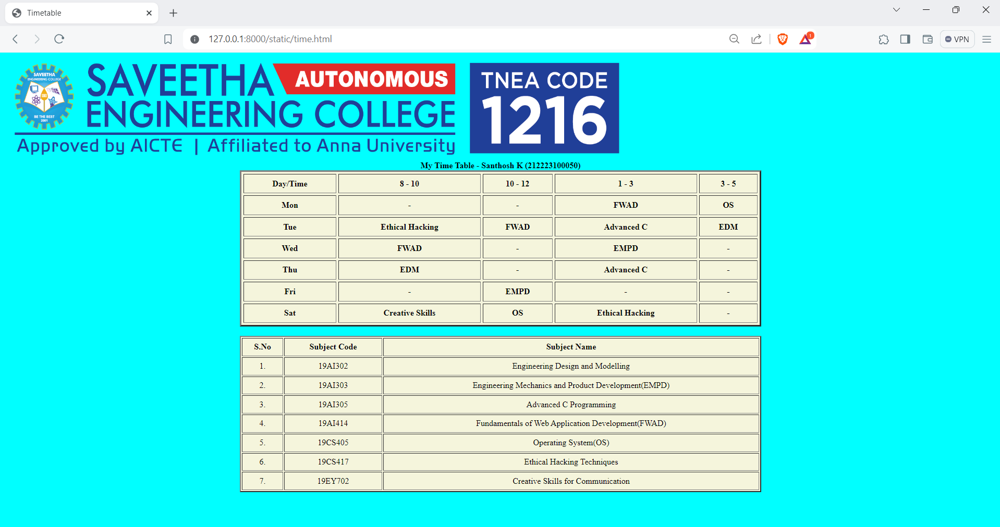

# Ex03 Time Table
## Date:18.03.2024

## AIM
To write a html webpage page to display your slot timetable.

## ALGORITHM
### STEP 1
Create a Django-admin Interface.

### STEP 2
Create a static folder and inert HTML code.

### STEP 3
Create a simple table using ```<table>``` tag in html.

### STEP 4
Add header row using ```<th>``` tag.

### STEP 5
Add your timetable using ```<td>``` tag.

### STEP 6
Execute the program using runserver command.

## PROGRAM
```
<!DOCTYPE html>
<html lang="en">
<head>
    <title>Timetable</title>
</head>
<body bgcolor="cyan">
       
    <table align="center" border="3" cellspacing="4" cellpadding="6" bgcolor="beige" height="300" width="1000">
        <caption><b>My Time Table - Santhosh K (212223100050)</b></caption>
        <tr>
        <th>Day/Time</th>
        <th>8 - 10</th>
        <th>10 - 12</th>
        <th>1 - 3</th>
        <th>3 - 5</th>
        </tr>

        <tr>
            <th>Mon</th>
            <th>-</th>
            <th>-</th>
            <th>FWAD</th>
            <th>OS</th>
        </tr>

        <tr>
            <th>Tue</th>
            <th>Ethical Hacking</th>
            <th>FWAD</th>
            <th>Advanced C</th>
            <th>EDM</th>
        </tr>

        <tr>
            <th>Wed</th>
            <th>FWAD</th>
            <th>-</th>
            <th>EMPD</th>
            <th>-</th>
        </tr>

        <tr>
            <th>Thu</th>
            <th>EDM</th>
            <th>-</th>
            <th>Advanced C</th>
            <th>-</th>
        </tr>

        <tr>
            <th>Fri</th>
            <th>-</th>
            <th>EMPD</th>
            <th>-</th>
            <th>-</th>
        </tr>

        <tr>
            <th>Sat</th>
            <th>Creative Skills</th>
            <th>OS</th>
            <th>Ethical Hacking</th>
            <th>-</th>
        </tr>
        
    </table>
    <br>
    <table align="center" border="2" cellspacing="2" cellpadding="4" bgcolor="beige" height="300" width="1000">
        <tr>
            <th>S.No</th>
            <th>Subject Code</th>
            <th>Subject Name</th>
        </tr>
        <tr>
            <td align="center">1.</td>
            <td align="center">19AI302</td>
            <td align="center">Engineering Design and Modelling</td>
        </tr>
        <tr>
            <td align="center">2.</td>
            <td align="center">19AI303</td>
            <td align="center">Engineering Mechanics and Product Development(EMPD)</td>
        </tr>
        <tr>
            <td align="center">3.</td>
            <td align="center">19AI305</td>
            <td align="center">Advanced C Programming</td>
        </tr>
        <tr>
            <td align="center">4.</td>
            <td align="center">19AI414</td>
            <td align="center">Fundamentals of Web Application Development(FWAD)</td>
        </tr>
        <tr>
            <td align="center">5.</td>
            <td align="center">19CS405</td>
            <td align="center">Operating System(OS)</td>
        </tr>
        <tr>
            <td align="center">6.</td>
            <td align="center">19CS417</td>
            <td align="center">Ethical Hacking Techniques</td>
        </tr>
        <tr>
            <td align="center">7.</td>
            <td align="center">19EY702</td>
            <td align="center">Creative Skills for Communication</td>
        </tr>
    </table>
</body>
</html>
```

## OUTPUT

## RESULT
The program for creating slot timetable using basic HTML tags is executed successfully.
